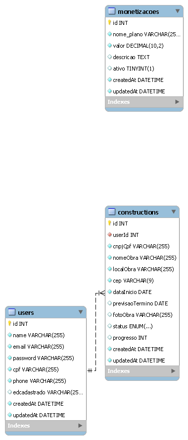
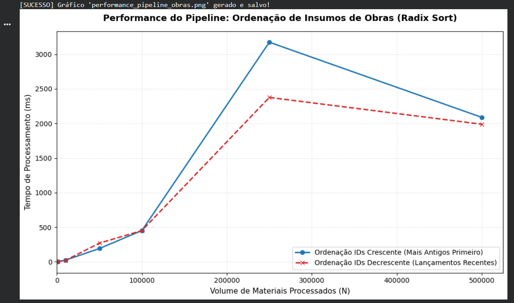
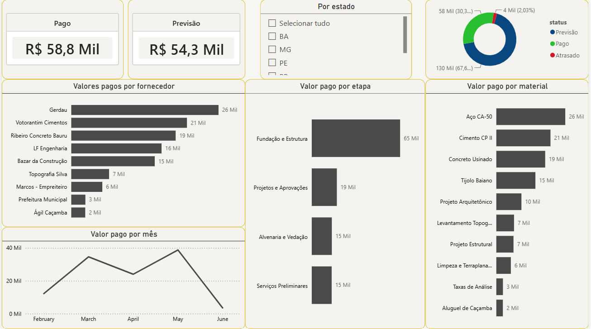

# 🏗️ Gestão de Obras - Pipeline de Dados & Performance

Este projeto simula uma infraestrutura moderna de Engenharia de Dados para um ecossistema de gestão de obras civis. Ele integra a modelagem relacional de usuários, construções e monetização de planos com algoritmos de alta performance, validação de integridade e testes de qualidade de dados de ponta a ponta.

---

## ⚡ Como rodar a aplicação localmente?

> 🚀 **Importante:** Para visualizar e rodar a aplicação rodando localmente em sua máquina, entre no diretório **APP_JDM_BD** e siga as instruções rápidas contidas nele.

---

## 📁 Estrutura do Projeto

* **`consultas em SQL/`**: Modelagem do banco de dados relacional.
    * `schema.sql`: Definição de tabelas, chaves primárias, chaves estrangeiras e relacionamentos de acordo com as regras de negócio.
    * `seeds.sql`: Dados simulados e realistas para popular o banco de dados.
    * `queries_analiticas.sql`: Consultas cotidianas focadas em tomadas de decisão rápidas (filtros, paginação, agrupamentos e JOINS).
* **`testes_performance_e_qualidade/`**: Algoritmos otimizados e automação de testes de confiabilidade.
    * `implementacaoradix.py`: Algoritmo matemático de ordenação ultra-rápida ($O(N)$) adaptado para IDs de materiais de construção.
    * `pipeline_performance.py`: Pipeline que simula a ordenação de grandes volumes de insumos e mede o tempo de execução.
    * `teste_data_quality.py`: Validação de entradas do usuário usando **Pydantic** para impedir valores negativos ou anomalias de dados.
    * `test_schema.py`: Garante que se o formato das tabelas ou arquivos mudar, o processo trave antes de gerar lixo.
    * `test_database_integration.py`: Teste que simula a inserção de relatórios em um banco **SQLite** em memória, provando a integração com bancos relacionais.
* **`diagrama.png`**: Modelo visual Entidade-Relacionamento do nosso banco.
* **`resultado_grafico_radixshort.png`**: Gráfico gerado pelo script demonstrando a excelente eficiência linear do algoritmo de ordenação.

---

## 📐 Arquitetura do Banco de Dados

Baseado no modelo do arquivo `diagrama.png`, estruturamos um banco de dados relacional que suporta:
1.  **Usuários (`users`)**: Engenheiros ou gestores cadastrados.
2.  **Construções (`constructions`)**: As obras vinculadas a cada usuário ($1:N$).
3.  **Monetizações (`monetizacoes`)**: Controle de planos de assinatura e planos de pagamento da plataforma.

<div align="center">
  
</div>

---

## 📊 Performance de Ordenação (Radix Sort)

Para otimizar o processamento em lote de materiais de construção (por exemplo, organizar cronologicamente ou por lotes de IDs de materiais da tabela SINAPI), implementamos uma variação matemática pura do **Radix Sort**. 

Abaixo está o gráfico gerado pelo nosso pipeline rodando o script `pipeline_performance.py`, que comprova o comportamento de escala linear ($O(N)$) do processamento, independentemente de estarmos ordenando de forma crescente ou decrescente:

<div align="center">
  
</div>

---

## 📊 Business Intelligence: O Dashboard de Gestão

Não adianta ter uma arquitetura de dados robusta se o tomador de decisão não conseguir ler os resultados. Esta camada do projeto transforma os dados brutos de insumos e usuários em decisões estratégicas para construtoras e incorporadoras.

O painel foi desenhado seguindo as melhores práticas de **UI/UX e Scannability**, utilizando uma paleta corporativa sóbria baseada em Tons de Grafite e Ouro (estilo incorporadora de alto padrão).

### 🖥️ Visualização do Painel

<div align="center">
  
</div>

### ⚙️ Engenharia e Arquitetura por Trás dos Gráficos
Para que esse visual funcionasse de forma fluida, a modelagem foi estruturada para suportar relações complexas entre tabelas dimensão e fato:

* **Modelo Relacional Integrado:** Conexão entre tabelas de Usuários, Projetos e Insumos através de um relacionamento cruzado com filtros bidirecionais.
* **Efeito Cascata:** O filtro de **Região/Estado (Dropdown)** recalcula instantaneamente todo o ecossistema do painel em tempo real através da cadeia: `Estado` ➔ `Obras Ativas` ➔ `Custos e Insumos`.
* **Otimização de Visuais:** Gráficos limpos de barras horizontais focados em Pareto (maiores gastos por Fornecedor, Etapa e Material), eliminando ruídos visuais e categorias zeradas.

### 🧮 Métricas Inteligentes (Fórmulas DAX)
Os indicadores (KPIs) de topo foram construídos sob medida usando linguagem DAX para garantir performance no carregamento:

* **Compras Realizadas:** Filtra e soma o fluxo de caixa efetivamente pago.
* **Previsão de Compras:** Antecipa os custos planejados e futuras saídas de caixa.
* **Inteligência de Status:** Segmentação precisa entre o que está Pago, A Pagar e Atrasado.

## 🛡️ Qualidade de Dados & Testes Automatizados

Não deixamos dados ruins irem para o banco. O projeto conta com testes unitários que garantem a segurança do negócio em três frentes:

1.  **Regra de Negócio (Data Quality):** Valores negativos para insumos de obras são rejeitados de imediato utilizando validações com `Pydantic`.
2.  **Segurança Estrutural (Schema):** Valida se o formato do dataset de entrada mantém colunas obrigatórias corretas.
3.  **Simulação de Integração (Mock DB):** Usamos o banco de dados SQLite em memória (`:memory:`) para garantir que os dados das obras persistam corretamente de forma rápida e limpa em ambientes de testes.

### Como rodar os testes localmente?
Basta ter o `pytest` instalado e executar o comando no terminal:
```bash
pytest testes_performance_e_qualidade/

Feito com 🛠️ por Mateus
